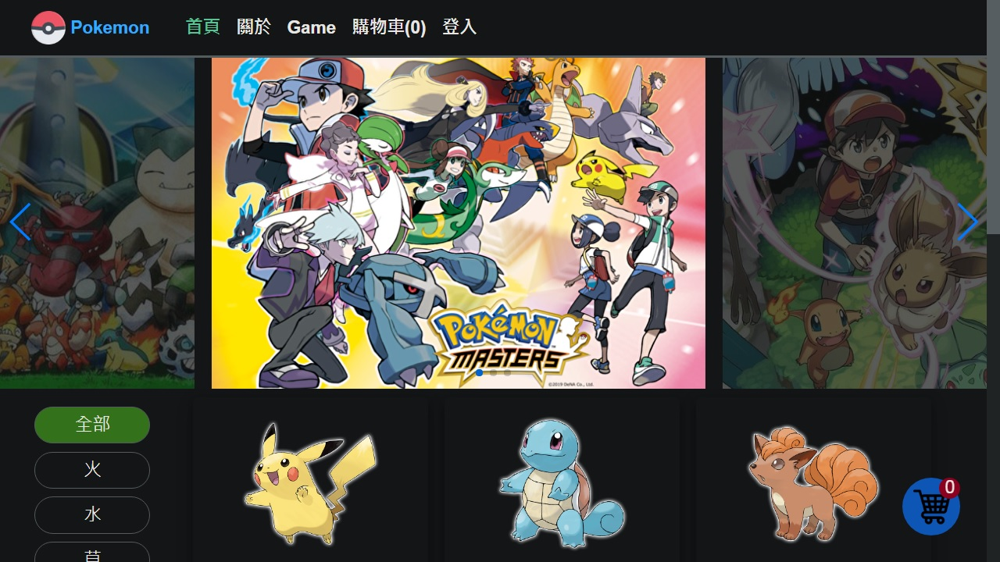

# vue-ecommerce
Vue電商網站，Vue CLI 4建立開發環境，Vuex儲存狀態容器，串接由Node.js Express MongoDB Atlas Heroku建立之RESTful API取得資料，Vue Router管理路由，localStorage儲存購物車資訊，內建Service Worker製作Progressive Web App。

# Live Demo
<a href="https://v8661087.github.io/Vue-Ecommerce/" target="_blank">https://v8661087.github.io/Vue-Ecommerce/</a>

# 使用技能
<ul>
<li>Vue</li>
<li>Vue CLI 4</li>
<li>Vuex</li>
<li>Vue Router</li>
<li>axios</li>
<li>vue-awesome-swiper</li>
<li>vue-loading-overlay</li>
</ul>

# 圖片來源
<ul>
<li>google圖片</li>
<li>寶可夢圖鑑 <a href="https://tw.portal-pokemon.com/play/pokedex">https://tw.portal-pokemon.com/play/pokedex</li>
</ul>
